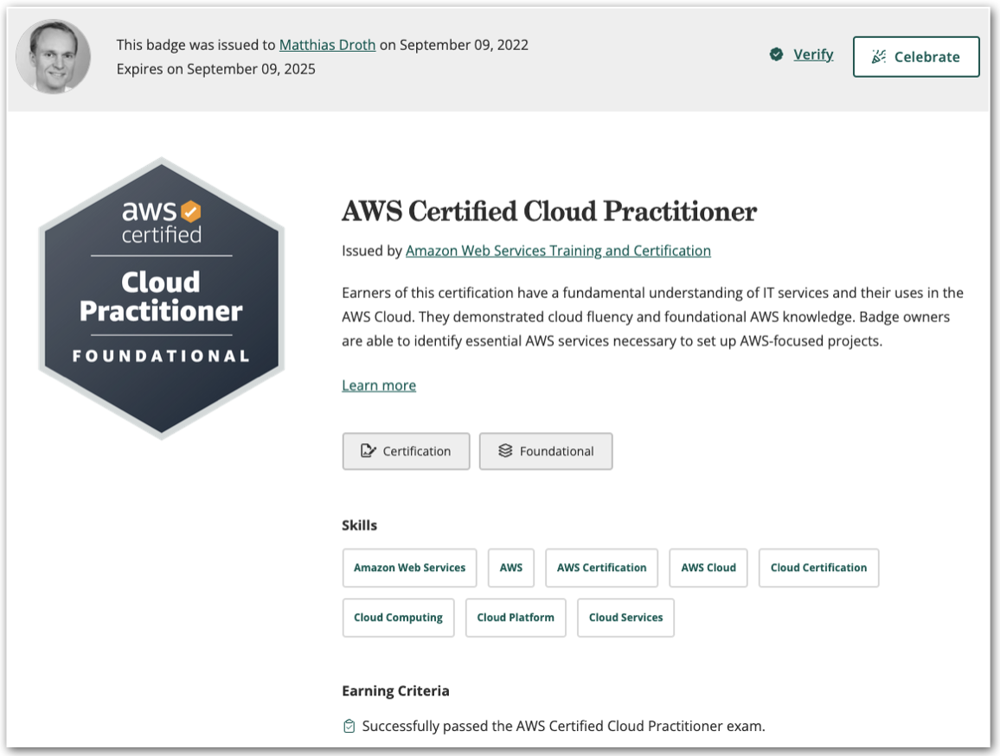
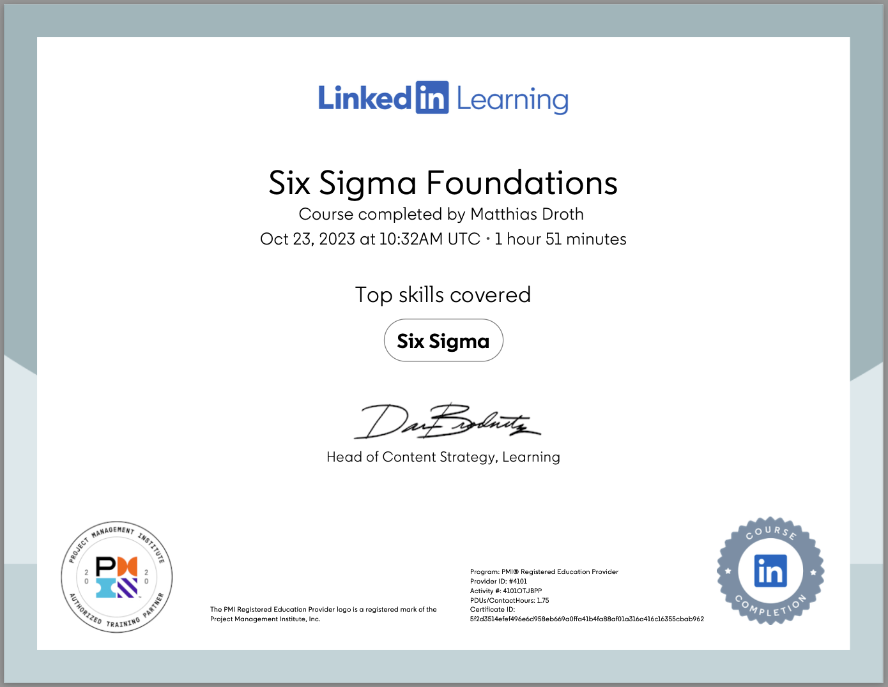

<h2>Welcome to my <i>github.io</i>!</h2>

Here, you can <b>view and verify</b> my certifications. For further details on my curriculum vitæ and interests, please refer to my <a href="https://de.linkedin.com/in/matthias-droth" target="_blank">Linked<b>in</b></a> and <a href="https://github.com/matthiasdroth/" target="_blank">GitHub</a> profiles.

Anything else &rArr; please contact me via <a href="mailto:matthias.droth@gmail.com" target="_blank">email</a>. I am looking forward to hear from you.

<!---->
<h3>Sections</h3>
<ul>
<li><a href="https://matthiasdroth.github.io/#ai-machine-learning">AI / Machine Learning</a></li>
<li><a href="https://matthiasdroth.github.io/#cloud-aws">Cloud / AWS</a></li>
<li><a href="https://matthiasdroth.github.io/#agile-methods">Agile Methods</a></li>
<li><a href="https://matthiasdroth.github.io/#entrepreneurship">Entrepreneurship</a></li>
</ul>

<!--AI / Machine Learning-->
<h3>AI / Machine Learning</h3>
<!---->

<h4>Training and Fine-tuning Large Language Models (LLMs)</h4>

Weights & Biases

<a href="https://www.credential.net/b6a03771-33c4-423e-90f8-aabf49881a01#gs.1zz0j7" target="_blank">Verify</a>

<!---->

<h4>XCS224U - Natural Language Understanding</h4>

Stanford School of Engineering

<a href="https://digitalcredential.stanford.edu/check/FC296E8BA54CC34BFA87E0CA11BBF7228B51D2E95D730E420708957B2FEDFB14bGpvcTd0eWl2WFBJTmxHMmxyNU1kLy94eDlndDk3LzFOdExBWGN1aitrZDBnWXU5" target="_blank">Verify</a>

<!---->

<h4>Building Transformer-Based Natural Language Processing Applications</h4>

Nvidia Deep Learning Institute

<a href="https://courses.nvidia.com/certificates/9631dd2e65324e3cbc352df537e10a4c/" target="_blank">Verify</a>

<!---->

<h4>Generative AI with Large Language Models</h4>

Coursera

<a href="https://coursera.org/verify/M35HPNABHQT7" target="_blank">Verify</a>

<!---->

<h4>Deep Learning: Advanced Computer Vision (GANs, SSD, +More!)</h4>

Udemy

<a href="https://www.udemy.com/certificate/UC-JT5ZMRRA/" target="_blank">Verify</a>

<!---->

<!--Cloud / AWS-->
<h3>Cloud / AWS</h3>
<!---->

<h4>AWS Certified Cloud Practitioner</h4>

Amazon Web Services

<a href="https://www.credly.com/badges/a61eb3bd-2994-4127-a2c8-10ddd9bb2bd6" target="_blank">Verify</a>

<!---->

<h4>Serverless using AWS Lambda for Python Developers</h4>

Udemy

<a href="https://www.udemy.com/certificate/UC-f9f08167-43df-46f6-9adb-609b66fc25a9/" target="_blank">Verify</a>

<!---->

<!--Agile Methods-->
<h3>Agile Methods</h3>
<!---->

<h4>Professional Scrum Master I</h4>

Scrum.org

<a href="https://www.credly.com/badges/e527b899-4211-4cca-8d64-f3b7cc749485" target="_blank">Verify</a>

<!---->

<h4>Six Sigma Foundations</h4>

LinkedIn Learning

<a href="https://www.linkedin.com/learning/certificates/5f2d3514efef496e6d958eb669a0ffa41b4fa88af01a316a416c16355cbab962" target="_blank">Verify</a>

<!---->

<h4>Software Processes and Agile Practices</h4>

Coursera

<a href="https://coursera.org/share/366081d842415b63c87e15cc71f5520a" target="_blank">Verify</a>

<!---->

<!--Entrepreneurship-->
<h3>Entrepreneurship</h3>
<!---->

<h4>Launching Tech Ventures</h4>

Harvard Business School Online

<a href="https://online.hbs.edu/verify-certificate?dvid=2X4NCSQM" target="_blank">Verify (may take 5+ seconds)</a>

<!---->
